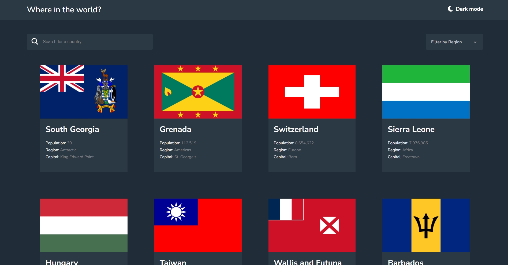
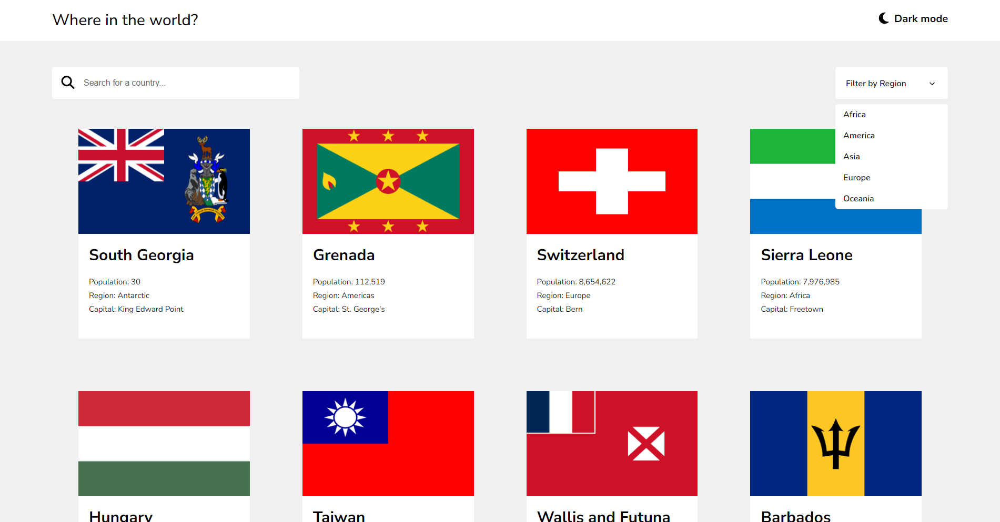

# Frontend Mentor - REST Countries API with color theme switcher solution

This is a solution to the [REST Countries API with color theme switcher challenge on Frontend Mentor](https://www.frontendmentor.io/challenges/rest-countries-api-with-color-theme-switcher-5cacc469fec04111f7b848ca). Frontend Mentor challenges help you improve your coding skills by building realistic projects.

## Table of contents

- [Overview](#overview)

  - [The challenge](#the-challenge)
  - [Screenshot](#screenshot)
  - [Links](#links)
  - [Built with](#built-with)
  - [What I learned](#what-i-learned)

## Overview

### The challenge

Users should be able to:

- See all countries from the API on the homepage
- Search for a country using an `input` field
- Filter countries by region
- Click on a country to see more detailed information on a separate page
- Click through to the border countries on the detail page
- Toggle the color scheme between light and dark mode _(optional)_

### Screenshot

### Links

- Live Site URL: [Add live site URL here](https://countries-api-hugo.netlify.app/)

### Built with

- HTML
- CSS
- SASS
- Flexbox
- CSS Grid
- JS
- Desktop-first workflow
- responsive

### What I learned

this helped me learn calling apis and displaying the data also filtering the data for the sort by region function.
( edit:i learned a lot of everthing while making this because i was pretty new to coding when i made this 5months ago)

## Acknowledgments

some credit goes too MDN Docs and chatgbt for helping me when i was really stuck.
